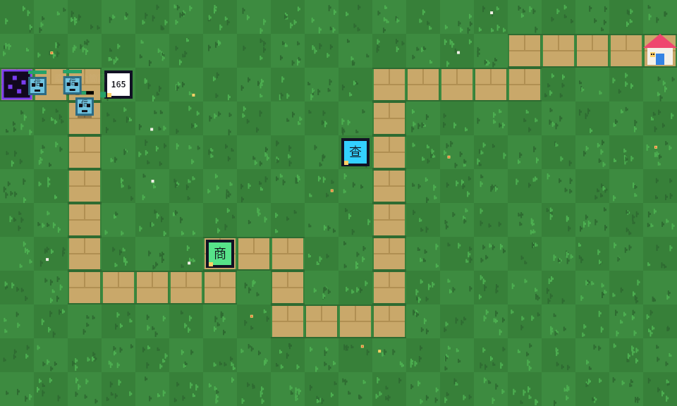
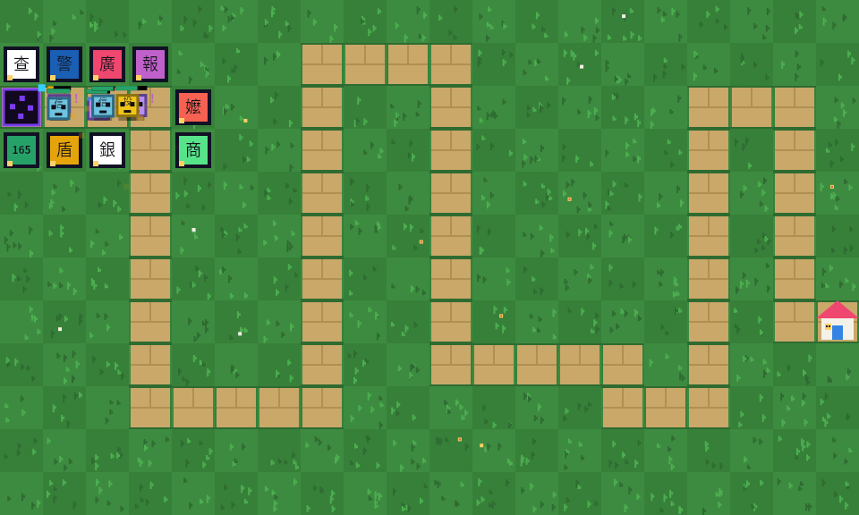
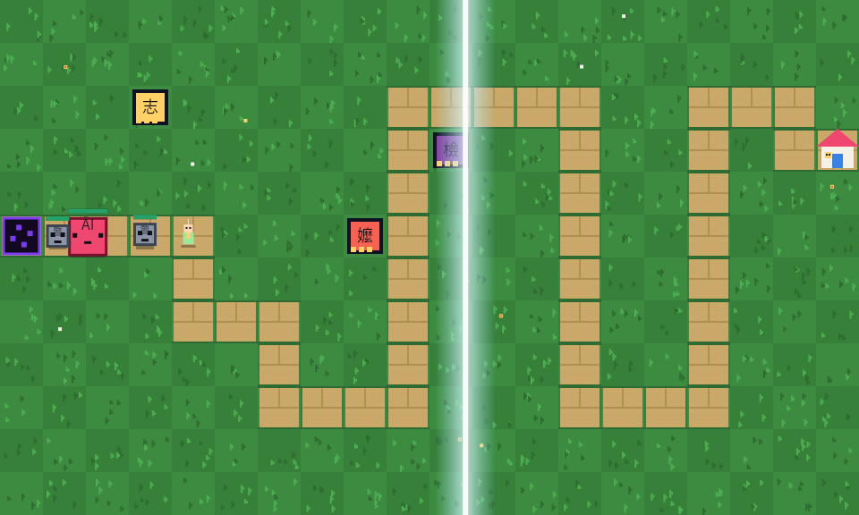
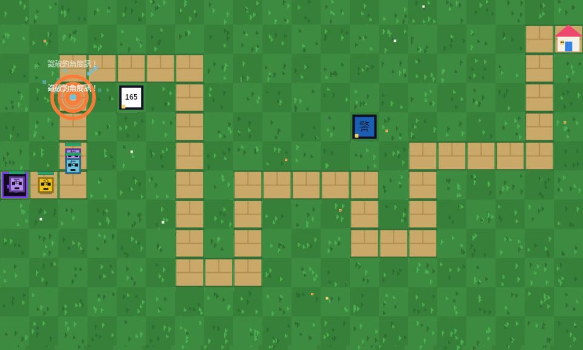
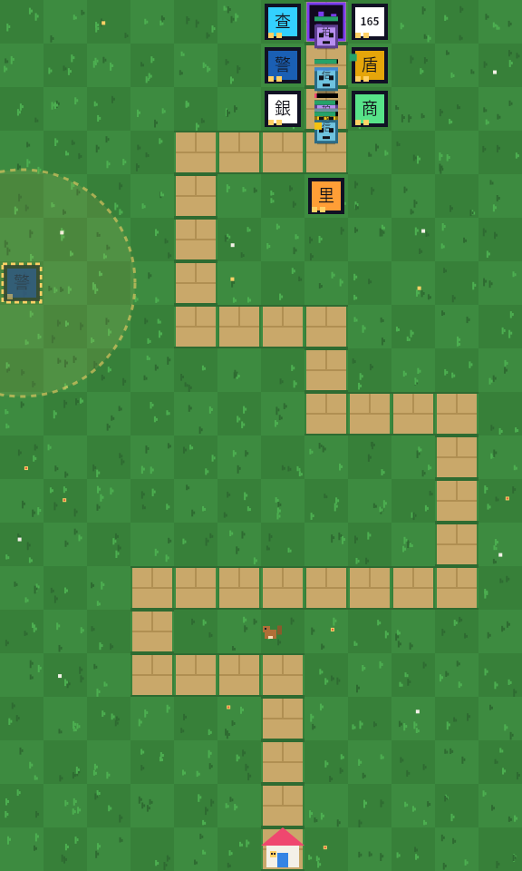

# 防詐迷宮 SCAM MAZE DEFENSE

87 關像素風防詐騙塔防遊戲。純 HTML + CSS + JS（零框架、零建置工具），公益用途，歡迎自由散播。

### ▶ 立即遊玩 Play Now：**<https://tonnychiulab.github.io/anti-scam-td/>**

手機、平板、電腦皆可玩｜中文・English・Bahasa Indonesia・Tiếng Việt｜免安裝・免註冊・零資料收集

## 遊戲截圖

| 第 1 關・佈陣防守 | 中期・防詐大軍集結 |
|---|---|
|  |  |

| 魔王關・🔦 強光橫掃 AI 深偽魔王 | 🔨 破門錘・衝擊波與識破浮字 |
|---|---|
|  |  |

| 📱 直立手機模式（v2.0-α）：棋盤轉置 12×20，由上而下防守 |
|---|
|  |

> 截圖為離線渲染版（武器圖示以文字呈現）；實際遊戲於瀏覽器中以 emoji 圖示顯示，並含 HUD、商店列與特種支援列。

> **聲明**：本遊戲由**全台熱血民眾**自發製作，是民間公益作品，**並非** 165 反詐騙專線、內政部警政署或任何政府機關的官方遊戲。防詐知識取材自公開宣導資料，僅供教育宣導，宣導不誤導——請勿誤信任何冒用本遊戲名義的連結或索款要求。

## 玩法

詐騙大軍（釣魚簡訊、假網拍、假投資、假檢警、AI 深偽魔王）沿迷宮衝向民眾。蓋防詐塔阻止它們——**13 種武器全部取材自真實防詐英雄**，隨關卡陸續解鎖：

| 武器 | 機制 | 解鎖 |
|---|---|---|
| 超商工讀生 | 便宜快手 | Lv.1 |
| 165 專線塔 | 均衡輸出 | Lv.1 |
| 查證雷達 | 減速 | Lv.1 |
| 銀行行員 | 臨櫃攔匯款，命中回收點數 | Lv.1 |
| 防火牆 | 範圍濺射 | Lv.1 |
| 警察 | 逮捕暈眩 | Lv.1 |
| 宣導廣播 | 遠距重砲 | Lv.1 |
| 里長廣播站 | 光環：範圍內塔攻速 +30% | Lv.5 |
| 記者爆料塔 | 標記「已曝光」，受傷 +50% | Lv.8 |
| 現身說法志工 | 陣亡詐騙轉化為反向掃蕩的志工，返抵傳送門 +1 血 | Lv.10 |
| 電信攔截塔 | 定期把最弱詐騙「已讀刪除」 | Lv.13 |
| 阿嬤智慧塔 | 「我孫子才不會這樣講話！」擊退 | Lv.16 |
| 檢察官起訴塔 | 低血量直接起訴定罪 | Lv.20 |

每識別（擊破）一隻詐騙 **血量 +1**；每局 **3 條命**；關卡之間跳出真實詐騙情境，**成功避開就 +1 命**。每關另有隨機修飾事件（詐騙加速日、大霧、豐收日、人海戰術），戰鬥中還會有**草地小幫手**驚喜登場——🐿 松鼠丟橡果支援、🐝 蜜蜂螫詐騙減速、🪱 蚯蚓翻出零錢、🐞 瓢蟲帶來好運 +1 血。分數可匿名留名排行榜（僅存於瀏覽器 localStorage，不上傳）。

## 部署 / 自架

正式版部署於 GitHub Pages：<https://tonnychiulab.github.io/anti-scam-td/>

想自架或 fork：把 6 個檔案（`index.html`、`style.css`、`game.js`、`i18n.js`、`sw.js`、`README.md`）加上 `screenshots/` 資料夾放到 repo 根目錄（或任何子目錄，路徑全為相對路徑），Settings → Pages → Source 選 `main` branch 即可。歡迎 fork 散播——這是公益作品。

## 多國語系（v1.3.0 MVP）

台灣有 70 多萬名外籍移工，也是詐騙高風險族群。本遊戲內建四種語言：**繁體中文、English、Bahasa Indonesia（印尼文）、Tiếng Việt（越南文）**——UI、13 種武器、12 題續命測驗、21 則防詐小知識全數翻譯，並加入 **1955 移工多語專線**宣導。

* 語言偵測順序：玩家選擇（localStorage）→ 瀏覽器語言 → English
* 開始畫面可隨時切換語言，遊戲中途切換也即時生效
* 字典集中在 `i18n.js`，新增語言只需複製一個語言區塊翻譯即可
* Roadmap：ภาษาไทย（泰文）、Tagalog（菲律賓文）——**誠徵母語者協助翻譯與校對**，現有印尼／越南文為 AI 初譯，歡迎指正

## 技術重點

* **RWD**：手機、平板、筆電、桌機皆可玩（pointer events 支援觸控）。
* **字型**：英文 Press Start 2P、中文 Cubic 11（皆為開源像素字型，Google Fonts CDN）；越南文變音符號自動退回系統字型。
* **快取**：Service Worker 快取優先策略，右下角即時顯示版本與快取命中率；無 SW 時以 Performance API 估算。
* **Roguelike**：每關迷宮由關卡種子重新生成，塔全額退點重新佈陣。
* **轉場**：每過一關播放快打旋風式色帶＋像素英雄動畫＋一則防詐小知識（純 CSS steps 動畫）。
* **重武器演出**：破門錘 hit-stop 慢動作、全螢幕爆閃層、canvas 衝擊波環與掃射光束、WebAudio sub-bass＋白噪爆音。

## 資訊安全（CIA 三要素設計）

* **機密性（C）**：零資料收集——不需註冊、不設 cookie、不呼叫任何 API。排行榜與玩家代號只存在玩家自己瀏覽器的 localStorage，永不上傳。CSP 限制腳本只能來自本站，外部資源僅 Google Fonts；`referrer: no-referrer` 防止外洩瀏覽來源。
* **完整性（I）**：排行榜名稱輸出時經 HTML escape 防 XSS；localStorage 載入時做型別消毒（長度、數值範圍、結構驗證）；SW 快取只收同源與字型資源，快取名稱隨版本號遞增，杜絕舊版檔案殘留。
* **可用性（A）**：Service Worker 快取優先，離線也能玩；localStorage 寫入以 try/catch 包裹，私密瀏覽模式不會中斷遊戲；字型載入失敗自動退回系統字型。

## 特種部隊支援（v1.4.0）

三種冷卻制主動技能，點按鈕再點地圖施放，每一發都有全螢幕演出（慢動作、爆閃、衝擊波、低頻爆音、震動）：

| 支援 | 效果 | 解鎖 / CD |
|---|---|---|
| 🔨 破門錘 | 點狀重擊＋擊退，命中瞬間全場慢動作 | Lv.3 / 40s |
| 💥 震撼彈 | 全螢幕白光，全場暈眩 2.5 秒＋爆心傷害 | Lv.7 / 55s |
| 🔦 強光手電筒 | 光束橫掃全圖，傷害＋「已曝光」標記 | Lv.11 / 50s |

## 版本紀錄

* **v2.0.0-b1**（2026-07-10）——行動裝置大改版 β：**點地建造面板**（手機點空草地→原地彈出 bottom-sheet，只列已解鎖塔、買不起灰顯、幽靈塔＋射程預覽、✓ 確認才扣款）；**雙指縮放平移**（1×–2.5×，單指=操作/雙指=手勢硬區分、12px tap-slop、雙擊回全圖、點擊座標反矩陣映射誤差 <10⁻¹² px）；手機隱藏武器列（桌機流程零改動）。
* **v2.0.0-a1**（2026-07-10）——行動裝置大改版 α：layoutMode 能力偵測（pointer/orientation）；直立手機棋盤自動轉置為 12×20 縱向迷宮（同種子＝同迷宮轉置版，排行榜不分榜）；**遊戲中途轉動手機無損切換視角**（塔/敵/志工/狀態全轉置，自動暫停 0.6s＋提示）；強光手電筒軸向感知（直立改縱掃）；行動版 UI：特種支援懸浮鈕貼拇指熱區、HUD 壓縮、武器列單排橫滑 dock、safe-area 支援。設計規格見 `docs/DESIGN-v2.md`（β：點地建造面板＋雙指縮放；正式版：PWA）。
* **v1.6.0**（2026-07-10）——外部審查修正輪（Grok＋CODEX 雙 AI 審查，21 條採納 18 條）：修復幽靈塔選單雙重退款漏洞、同幀多敵漏進只扣一命、塔選單定位錯誤（移入 #stage）、減速/暈眩/標記改用遊戲時間（倍速與暫停行為一致）、聲波環誤畫在銀行行員、損命後清空志工/光束/小幫手並重打本波、放塔獨立驗證解鎖等級、里長光環對齊 +30% 文案、勝利標題四語化、解鎖清單分隔符依語言、生命列以上限 5 顯示、儲存失敗誠實回報、AudioContext 手勢解鎖、草地離屏渲染（行動效能）、SW 改 stale-while-revalidate＋離線導航後備、開放頁面縮放（無障礙）、跨局 setTimeout 世代防護。
* **v1.5.0**（2026-07-10）——版面修正：100% 縮放下畫布高度隨視窗自適應（`100dvh`），寬螢幕武器列單排排滿，全 UI 保證一屏內完整可見；新增「草地小幫手」彩蛋：松鼠（丟橡果攻擊）、蜜蜂（螫敵減速）、蚯蚓（翻出零錢 +8）、瓢蟲（好運 +1 血），像素動畫＋四語浮字，戰鬥中每 11–22 秒隨機登場。
* **v1.4.1**（2026-07-10）——敗北安慰場景：詐團得逞時不再有任何可能嘲諷受害者的元素。標題改為「💙 這局先告一段落」、柔和藍色調面板、暖光陪伴像素插畫、溫柔上行三音（取代失敗低音）、四語安慰提醒文（被騙不是因為笨／165 黃金 30 分鐘／1955 移工專線／告訴家人／休息再來）。
* **v1.4.0**（2026-07-09）——特種部隊支援系統：破門錘／震撼彈／強光手電筒三種主動技能，含 hit-stop 慢動作、全螢幕爆閃、衝擊波環、WebAudio 低頻爆音（四語支援）。
* **v1.3.0**（2026-07-09）——多國語系 MVP：zh/en/id/vi 四語完整翻譯（含測驗與小知識）、語言自動偵測＋切換鈕、1955 移工專線宣導、SW 快取納入 i18n.js。
* **v1.2.0**——版本號；遊戲團隊檢視：自動出怪倒數、難度曲線軟化＋過關 5% 利息、關卡修飾事件、過關防詐小知識、擊破浮字；資安 CIA 檢視：CSP＋Referrer Policy、排行榜型別消毒、localStorage 例外處理、SW 快取版本化。
* **v1.1.0**——武器擴充至 13 種（隨關卡解鎖）、仿真綠草地、非官方聲明。
* **v1.0.0**——首發：87 關、四武器、3 命、避詐續命、匿名排行、SW 快取、過關轉場。

資料參考：內政部警政署 165 打詐儀錶板。遊戲內所有詐騙情境改編自台灣真實常見手法。
