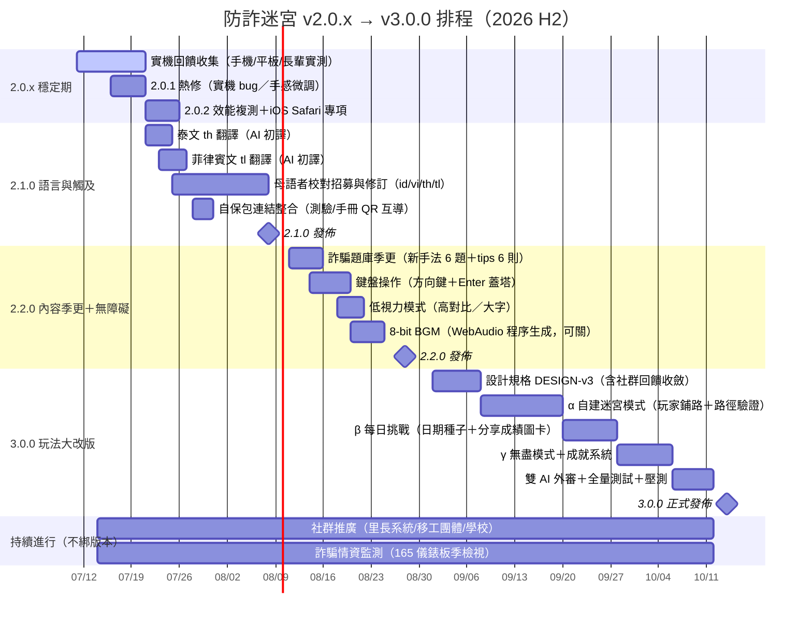

# 防詐迷宮 開發路線圖（2026-07 定版）

> 結論：**不直接跳 3.0.0**。先以 2.0.x 穩定實機體驗，2.x 擴充內容與觸及率，
> 3.0.0 保留給「玩法典範轉移」（自建迷宮＋每日挑戰）。
> 版本原則：**patch＝修復、minor＝加內容不改架構、major＝改變玩法或架構**。

## 甘特圖

## 版本決策理由

**為什麼不是 3.0.0 先行？** 語意化版本中 major 代表不相容或典範轉移。2.0.0 剛把「行動體驗」翻新，架構（轉置棋盤、建造面板、view 矩陣、i18n 字典）都是新鋪的路，接下來的泰/菲語、題庫更新、無障礙全都能在這條路上直跑——掛 2.x 才誠實。**3.0.0 的門檻**是改變「玩的方式」：自建迷宮讓玩家從「防守者」變「迷宮設計師」（Rogue Maze 的靈魂機制，也是最初的風格致敬）、每日挑戰引入「全球同題競技」的社交層。這兩件事會動到關卡生成核心與分享機制，值得 major。

## 各版本任務清單

### 2.0.x 穩定期（7/11–7/25）｜目標：實機零已知 bug

| # | 任務 | 優先 | 工作量 | 驗收標準 |
|---|------|:---:|:---:|----------|
| 1 | 收集實機回饋（Android/iOS/平板/長輩實測 5 人以上） | P0 | 持續 | 回饋清單建檔於 issues |
| 2 | 2.0.1：實機 bug 熱修（手勢、safe-area、鍵盤彈出等） | P0 | 3–5 天 | 回報 bug 全數關閉 |
| 3 | 2.0.2：iOS Safari 專項（音訊、100dvh、PWA 安裝路徑） | P1 | 3 天 | iPhone 實測清單全過 |
| 4 | 效能複測：中階 Android 50fps 驗證 | P1 | 1 天 | 實測錄影佐證 |

### 2.1.0 語言與觸及（7/21–8/8）｜目標：六語＋自保包生態互導

| # | 任務 | 優先 | 工作量 | 驗收標準 |
|---|------|:---:|:---:|----------|
| 1 | 泰文（th）、菲律賓文（tl）AI 初譯進 i18n.js | P0 | 各 1 天 | 六語結構一致性測試過 |
| 2 | 母語者校對（id/vi/th/tl，README 公開招募） | P0 | 2 週窗口 | 至少各 1 位母語者過目 |
| 3 | 語言切換鈕擴為 6 顆＋自動偵測補 th/tl | P0 | 0.5 天 | 四→六語迴歸全過 |
| 4 | 自保包整合：測驗 HTML 尾端放遊戲連結；遊戲結算畫面放手冊連結 | P1 | 1 天 | 互導連結上線 |
| 5 | 分享圖卡：結算畫面「分享成績」產生 canvas 圖卡（含遊戲網址） | P2 | 2 天 | LINE 分享實測 |

### 2.2.0 內容季更＋無障礙（8/11–8/28）｜目標：內容保鮮、更多人能玩

| # | 任務 | 優先 | 工作量 | 驗收標準 |
|---|------|:---:|:---:|----------|
| 1 | 題庫季更：165 儀錶板新手法 → 續命測驗 +6 題、tips +6 則（六語） | P0 | 3 天 | 事實查核＋六語齊 |
| 2 | 鍵盤操作：方向鍵格子游標＋Enter 建造面板＋數字鍵選塔 | P1 | 4 天 | 全程不碰滑鼠可通關 |
| 3 | 低視力模式：高對比配色＋UI 字級 +25% 開關 | P1 | 2 天 | 開關持久化、全畫面適用 |
| 4 | 8-bit BGM：WebAudio 程序生成循環曲（預設關、可開） | P2 | 3 天 | 不影響 SFX、可靜音 |
| 5 | prefers-reduced-motion：轉場/爆閃降級 | P2 | 1 天 | 系統設定連動 |

### 3.0.0 玩法大改版（9/1–10/14）｜目標：從「防守」進化到「設計迷宮」

| # | 任務 | 優先 | 工作量 | 驗收標準 |
|---|------|:---:|:---:|----------|
| 1 | DESIGN-v3 規格（收斂 2.x 期間社群許願） | P0 | 1 週 | 與維護者定案三大決策 |
| 2 | **自建迷宮模式**：玩家用「鋪路點數」自己畫路（起點→終點），路越長詐騙走越久；路徑合法性即時驗證 | P0 | 2 週 | 路徑驗證測試＋防呆 |
| 3 | **每日挑戰**：日期種子產生當日唯一迷宮＋修飾組合，全球同題；成績以分享圖卡傳播（無後端、零資料收集不變） | P0 | 8 天 | 同日同題驗證、圖卡含日期 |
| 4 | 無盡模式：87 關後接無限波次，波數上排行 | P1 | 4 天 | 難度曲線壓測 |
| 5 | 成就系統：20 個成就（識詐主題），localStorage | P2 | 4 天 | 成就觸發測試 |
| 6 | 雙 AI 外審（沿用 Grok＋CODEX 流程）＋全量測試 | P0 | 6 天 | 採納率報告＋全綠 |

### 持續軌（不綁版本）

- **推廣**：里長辦公室/社區大學/移工團體/學校資訊課接洽——公益授權、可印 QR 海報（可從手冊衍生）。
- **情資保鮮**：每季檢視 165 打詐儀錶板 Top 手法，滾動更新題庫（對應 2.2.0 之後每季一次 minor）。
- **維運鐵律**：每次發佈 bump `APP_VERSION`＋SW `CACHE`＋i18n credit ×N＋README changelog；發佈前跑全量測試；重大版本必經外部 AI 審查。

## 風險與備註

- 母語校對招募是 2.1.0 唯一外部依賴，若 8/8 前未到位 → 標註「AI 初譯」照常發佈，校對後補 patch。
- 每日挑戰堅守**零後端**底線：排行仍在本機，全球比較靠分享圖卡的社群傳播（設計上的取捨，寫進 DESIGN-v3）。
- 甘特日期為單人業餘節奏估算（每日 1–3 小時），全職節奏可整體壓縮約 40%。
