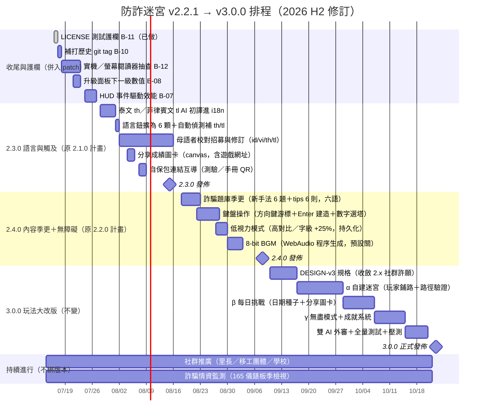

# 防詐迷宮 開發路線圖（2026-07-16 修訂）

> **本次修訂原因**：原路線圖（2026-07-11 定版）與實際出貨已明顯分歧——版本號被「行動 UX 修補」與「制裁技」用掉，原本排在 2.1.0 的**語言擴充**與排在 2.2.0 的**內容季更＋無障礙**都尚未進行。此版把地圖修正到與現實一致，並從 v2.2.1 往後重排。
>
> 版本原則不變：**patch＝修復、minor＝加內容不改架構、major＝改變玩法或架構**。3.0.0 仍保留給「玩法典範轉移」（自建迷宮＋每日挑戰）。

## 現況快照（2026-07-16）

- 線上版本：**v2.2.1**，已部署（`origin/main` @ `5281af8`，PR #6）。
- 語言：**4 種**（zh／en／id／vi）——泰文／菲律賓文尚未加入。
- 自動測試：47 項（本次新增 LICENSE 護欄後為 48）。
- 授權：MIT（公益），`LICENSE` 已加測試護欄防誤刪。

---

## 已出貨版本（實際 vs 原計畫）

| 版本 | 日期 | 實際內容 | 對照原計畫 |
|---|---|---|---|
| v1.6.0 | 07-10 | 雙 AI 外審修補、輸家場景重設計、SWR service worker | — |
| v2.0.0 | 07-10 | 行動體驗翻新：棋盤轉置、點地建造、雙指縮放、PWA、行動效能 | ✅ 符合「2.0.x 穩定期」 |
| v2.0.2 | 07-13 | PC 控制與回歸修復 | ✅ 穩定期熱修 |
| v2.1.0 | 07-13 | 行動導引與 UX（route guide、危險提示、mobile guidance） | ⚠️ 原計畫是「語言與觸及」，**改做行動 UX** |
| v2.1.1 | 07-15 | 行動 UX 修補：暫停語意、震動遵守、音效持久化、PWA 交接、手勢互斥、建塔無障礙 | ⚠️ 消化 `BACKLOG-v2.1.1` 的 B-01～B-06 |
| v2.1.2 | 07-15 | 戰鬥視覺清晰度：分數提示移 HUD、擊破文字層級 | ⚠️ 計畫外的體驗修補 |
| v2.2.0 | 07-15 | **制裁技**（絆倒車手／ATM 守護／爆破詐騙機房）＋新敵人詐騙車手＋命中停格演出 | ⚠️ 原計畫 2.2.0 是「內容季更＋無障礙」，**改做制裁技** |
| v2.2.1 | 07-15 | 安全強化：SW 預快取容錯、排行榜寫入淨化、i18n HTML 轉義、`SECURITY-I18N.md` | ⚠️ 依獨立審查 4 項 P1，計畫外 |

**分歧結論**：實機打磨與戰鬥深度（制裁技）被優先做掉了，這是合理的取捨——先讓核心玩法與行動體驗紮實。代價是**語言擴充**與**內容季更**延後，版本號往前跑到 2.2.x。以下往後排程據此重新編號（下一個 minor 為 **v2.3.0**）。

---

## 修訂後排程（從 v2.2.1 往後）

---

## 版本決策理由

**為什麼下一個 minor 是 2.3.0 而非補回 2.1/2.2？** 語意化版本只往前走。2.1.x 與 2.2.x 的號碼已經對應到實際出貨的行動 UX 與制裁技，把「語言擴充」硬塞回 2.1.0 會讓 changelog 說謊。誠實的做法是：承認分歧、原計畫主題順延到 2.3.0／2.4.0。

**為什麼還不是 3.0.0？** major 代表玩法或架構的典範轉移。目前架構（轉置棋盤、建造面板、view 矩陣、i18n 字典、支援／制裁技冷卻框架）都還撐得住語言、題庫、無障礙的擴充——掛 2.x 才誠實。3.0.0 的門檻是改變「玩的方式」：自建迷宮讓玩家從「防守者」變「迷宮設計師」，每日挑戰引入「全球同題」社交層。這兩件會動到關卡生成核心與分享機制，值得 major。

---

## Backlog 收尾清單（源自 `BACKLOG-v2.1.1.md`）

| 項目 | 主題 | 狀態 |
|---|---|---|
| B-00 | 還原被刪的 LICENSE | ✅ 已還原（2026-07-16） |
| B-01 | 強光蓄力不得跨越暫停完成 | ✅ v2.1.1 |
| B-02 | 減少動態／最低品質不得震動 | ✅ v2.1.1 |
| B-03 | 音效偏好持久化 | ✅ v2.1.1 |
| B-04 | PWA 新版本交接（network-first） | ✅ v2.1.1 |
| B-05 | 手機手勢與建塔預覽互斥 | ✅ v2.1.1 |
| B-06 | 建塔面板無障礙與失敗回饋 | ✅ v2.1.1 |
| B-07 | HUD 改事件／dirty-flag 更新 | ⬜ 待做（效能，排入 patch） |
| B-08 | 升級面板補下一級數值 | ⬜ 待做（排入 patch） |
| B-09 | 路線／危險導引多語與宣告 | 🟡 部分（建塔錯誤已多語；`#dangerEdge` 名稱多語待確認） |
| B-10 | 發布打 git tag | ⬜ 待做（目前 0 個 tag） |
| B-11 | CI「LICENSE 必須存在」檢查 | ✅ 已加入 `tests/release.test.mjs`（2026-07-16） |
| B-12 | 上線前真機與螢幕閱讀器抽查 | ⬜ 待做（需實體 iOS／Android） |

---

## 持續軌（不綁版本）

- **推廣**：里長辦公室／社區大學／移工團體／學校資訊課接洽——公益授權、可印 QR 海報。
- **情資保鮮**：每季檢視 165 打詐儀錶板 Top 手法，滾動更新題庫（對應每季一次 minor 內容季更）。

## 維運鐵律（更新版）

每次發佈：

1. bump `APP_VERSION`、`package.json version`、SW `CACHE`、`index.html` credit、i18n credit ×4（見 `AGENTS.md` 版本同步清單）。
2. 跑全量測試 `npm test`（含 LICENSE 護欄與 XSS／淨化檢查）。
3. **打 annotated git tag**（如 `v2.3.0`），指向實際部署 commit——修正過去只靠 commit message 標版的問題。
4. 動到 i18n／HTML 輸出時，遵守並同步 `SECURITY-I18N.md`。
5. 重大版本必經外部 AI 審查（沿用 Grok＋CODEX 流程），並補該版 `CODE-REVIEW`、`RELEASE-VALIDATION`、`WORKLOG`。

## 風險與備註

- 母語校對招募是 2.3.0 唯一外部依賴；若窗口內未到位 → 標「AI 初譯」照常發佈，校對後補 patch。
- 每日挑戰堅守**零後端**底線：排行仍在本機，全球比較靠分享圖卡的社群傳播（設計取捨，寫進 DESIGN-v3）。
- 甘特日期為單人業餘節奏估算（每日 1–3 小時），全職節奏可整體壓縮約 40%。
- 版本號分歧已是既成事實，本路線圖以「往前誠實編號」處理，不回頭改寫已出貨版本的號碼。
