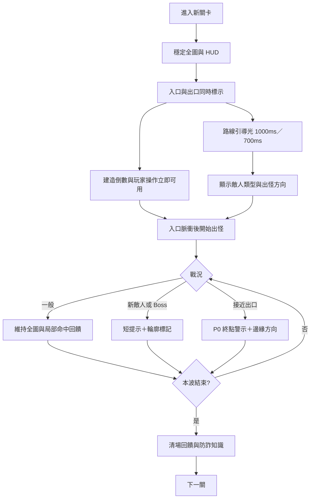
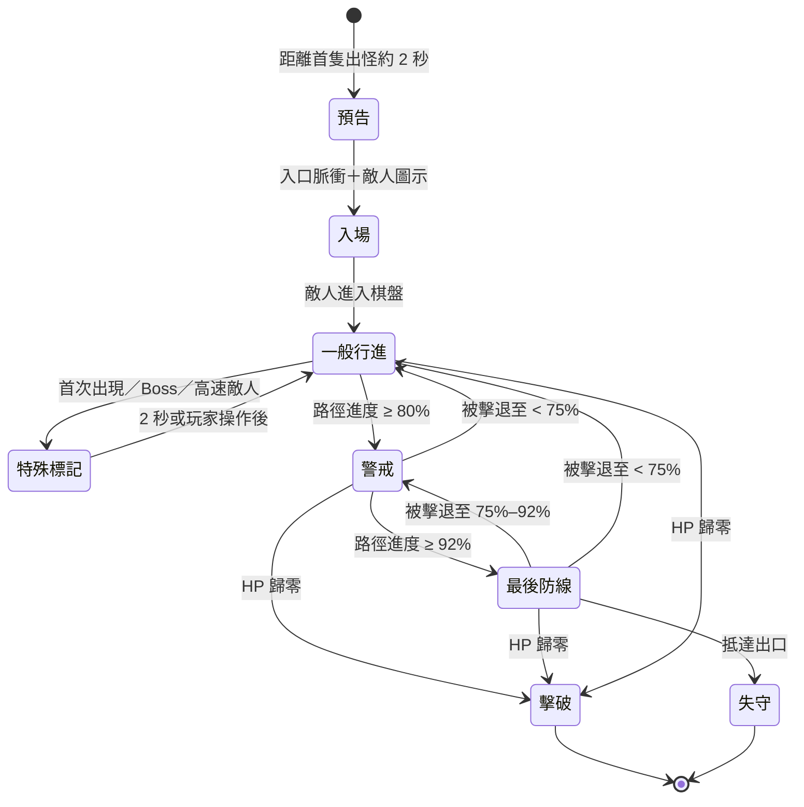
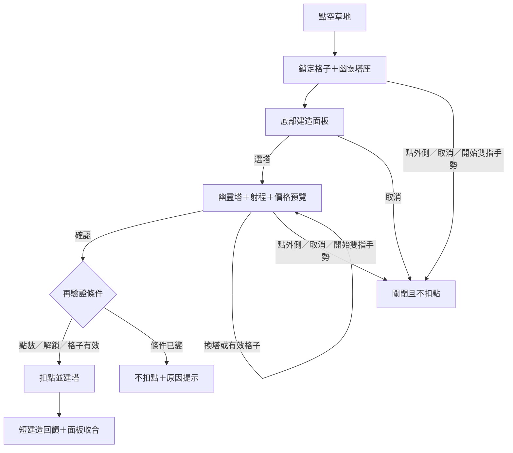
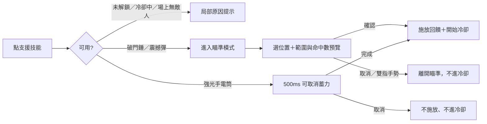

# Claude Fable5 v2.1 行動視覺導引與操作體驗規格（決策完成版）

- 文件狀態：✅ D-01 至 D-10 全數確認；尚未批准程式實作
- 建立日期：2026-07-13
- 決策完成日期：2026-07-13
- 適用範圍：手機直式、手機橫式；平板沿用能力偵測結果
- 前置基礎：v2.0 的棋盤轉置、雙指縮放、點地建造面板、safe-area 與 PWA
- 核心原則：**穩定全局視角＋漸進式導視；特效服務判讀，不搶走操作權**

> 本文件是 v2.1 行動 UX 的唯一決策基準，只定義 UX、動態表現與驗收方式，不包含程式實作。未取得明確實作授權前，不得修改遊戲程式。

## 0. 版本定位（已確認）

v2.1.0 專注「行動視覺導引與操作體驗」。`docs/ROADMAP.md` 原排定的「語言與觸及」順延至下一個 minor 版本，不把新語言功能放進 v2.1.x patch。

### 已確認決策

- **D-01（2026-07-13）：採方案 1。** v2.1.0 專注「行動視覺導引與操作體驗」；原語言計畫順延至下一個 minor 版本。
- **D-02（2026-07-13）：每個新關卡播放路線引導光。** 完整棋盤與入口／出口從第一幀可見；第 1–3 關 1000ms，第 4 關起 700ms；不阻擋操作、不延後倒數，玩家操作時立即完成；減少動態模式直接顯示完整路線。
- **D-03（2026-07-13）：系統不自動追蹤、放大或移動鏡頭。** 畫面內的危險敵人使用外框與出口脈衝；畫面外使用合併數量的方向箭頭。只有玩家點擊箭頭時，才保留目前縮放倍率並置中到最接近出口的敵人。
- **D-04（2026-07-13）：手機 HUD 常駐速度、暫停與更多。** 音效移入更多選單；HUD 採兩列配置，三顆控制至少 44×44 CSS px。更多選單打開時暫停遊戲，關閉後依玩家原本的暫停狀態決定是否恢復。
- **D-05（2026-07-13）：手機維持二段建塔確認。** 選塔後只顯示幽靈塔、實際射程、價格與剩餘點數，只有固定位置的確認按鈕能扣點。預覽期間可直接更換塔或格子；建造完成後收合面板並清除選擇，不提供連續快速建造。
- **D-06（2026-07-13）：升級直接執行，拆除面板內二次確認。** 升級按鈕顯示費用與升級後餘額，每次只升一級並以約 350ms 防止意外連點。拆除第一次點擊只進入 3 秒確認狀態，清楚顯示退款與 30% 損失；再次點擊才拆除，不使用全畫面確認視窗。
- **D-07（2026-07-13）：位置型支援二次確認，全圖型短蓄力。** 破門錘與震撼彈採「選技能 → 選位置 → 顯示範圍與命中數 → 確認」；強光手電筒不選位置，經 500ms 可取消蓄力後施放。場上沒有敵人時三種技能都不能施放，冷卻從真正施放時才開始。
- **D-08（2026-07-13）：視覺效果提供自動、完整、精簡三段，預設自動。** 自動模式低於 45fps 約 3 秒降為精簡，精簡後低於 30fps 約 2 秒進入最低保護；高於 55fps 約 12 秒後只在波次間升級。品質切換至少間隔 15 秒，重要導視與操作資訊永不移除，偏好與上次穩定狀態只保存在本機。
- **D-09（2026-07-13）：路徑進度 80% 進入警戒，92% 進入最後防線。** 敵人退回 75% 以下或死亡才解除目前危險狀態；每名敵人只記錄一次，同一波只震動及高優先警告一次。後續只更新合併數量與視覺狀態，全部危險解除 2 秒後收起提示。
- **D-10（2026-07-13）：手機移除常駐總分，桌機維持現況。** 手機以 800ms 合併的短暫 `⭐ +N` 提供即時回饋；總分顯示於更多選單、關卡結算、問答結果、最終結算與排行榜。計分公式與資料保存方式不變。

## 1. 目標與非目標

### 目標

1. 玩家進入關卡後，3 秒內看懂入口、出口、敵人方向與主要防守區。
2. 在 360–430 CSS px 寬的直式手機上，重要資訊不遮住主要路線。
3. 建塔、升級、拆除與支援技能都有清楚的「預覽 → 確認 → 回饋」。
4. 危險訊息有優先級，不同提示不互相覆蓋或連續震動。
5. 中階手機維持目前效能目標；低階裝置與減少動態模式仍能清楚判讀。

### 非目標

- 不改變 87 關、敵人數值、塔價格、地圖種子與排行榜計分。
- 不讓鏡頭自動追逐普通敵人。
- 不加入需要後端、帳號或玩家追蹤的功能。
- 不以大量粒子、頻繁全畫面震動或閃白取代資訊設計。
- 不改動桌機既有「先選塔，再點地」的核心流程。

## 2. 核心 UX 決策

### 2.1 鏡頭策略

採用**固定全圖為預設**：

- 關卡開始、出怪與危險提示只改變棋盤內的標示，不主動平移或放大鏡頭。
- 玩家手動縮放後，系統不搶回全圖；危險敵人在可視範圍外時改用邊緣指示。
- 只有玩家雙擊空白處，才重設為全圖。
- 轉向仍沿用 v2.0 的短暫暫停與無損轉置。

理由：塔防需要同時比較路線、塔位、入口與終點。自動跟拍會破壞空間記憶，也容易造成暈動。

### 2.2 視覺導引層級

| 優先級 | 類型 | 範例 | 顯示規則 |
|---|---|---|---|
| P0 | 必須立即處理 | 敵人接近出口、即將失去生命 | 可中斷 P2/P3；圖示＋文字＋局部脈衝 |
| P1 | 操作狀態 | 建塔預覽、支援技能瞄準 | 操作期間持續；完成或取消後立即消失 |
| P2 | 戰況資訊 | 新敵人類型、Boss、入口出怪 | 最多 2 秒；相同提示短時間合併 |
| P3 | 氛圍效果 | 迷宮描線、擊破粒子、草地動態 | 不得遮住 P0/P1；低效能時優先降級 |

同一時間最多顯示一個 P0／P1 主提示及一個 P2 次提示。

## 3. 關卡主流程



### 3.1 關卡開場時序（已確認）

| 時間 | 畫面 | 操作規則 |
|---:|---|---|
| 0ms | 完整棋盤、HUD、入口與出口立即可見；開始建造倒數 | 棋盤出現後即可操作 |
| 0–T | 引導光由入口沿路線移動到出口；不隱藏草地或塔位 | 玩家操作時立即完成引導，且同一次操作繼續執行 |
| T–T+600ms | 顯示本關敵人圖示、方向與事件修飾 | 完整操作 |
| 其後 | 正常配置與出怪 | 完整操作 |

其中 T：第 1–3 關為 1000ms，第 4 關起為 700ms。動畫總長固定，不使用每格固定時間，避免較長路線拖慢節奏。

規則：揭示動畫不能延長原本出怪倒數；雙指縮放、暫停或轉向不重新播放。減少動態模式不播放移動效果，直接顯示入口、出口與完整路線。

### 3.2 重複遊玩降噪

- 第 1–3 關使用 1000ms 完整路線引導。
- 第 4 關起固定為 700ms，保留入口、出口與方向。
- 不設「略過」按鈕；玩家進行任何棋盤操作時，引導立即完成且不得吃掉該次操作。
- 系統開啟「減少動態」時，入口、出口與完整路線直接顯示，不逐格移動。

## 4. 敵人導視流程



### 4.1 一般敵人

- 不顯示大型文字卡，不追鏡頭。
- 入口在出怪前做 2 次局部脈衝，搭配方向箭頭。
- 命中回饋以敵人自身的短閃、血條變化與狀態圖示為主。

### 4.2 首次出現與特殊敵人

- 每個敵人種類每局最多顯示一次名稱提示。
- Boss 使用較明顯輪廓與頂端短提示，但不遮住 HUD。
- 高速、隱匿或高血量敵人使用不同形狀的小圖示，不能只靠顏色。

### 4.3 接近出口

- 路徑進度達 80% 且仍存活時進入第一級警戒；達 92% 時進入「最後防線」。進度以路徑段落計算，不依畫面座標、方向或縮放倍率。
- 80% 時出口格局部脈衝，顯示一次「敵人接近出口」；92% 時改為更強外框及「最後防線 ×N」，但不再次震動或播放大型通知。
- 進入警戒後，只有退回 75% 以下或死亡才解除該敵人的目前危險狀態，避免擊退與浮點誤差造成提示反覆開關。
- 每名敵人第一次跨過 80% 後標記為已警告；被擊退再走回時不重播高優先提醒。
- 危險敵人在目前畫面內時，以外框高亮約 1.2 秒；不放大、不震動畫面。
- 危險敵人在玩家縮放後的畫面外時，棋盤邊緣顯示方向箭頭；同方向多名敵人合併為 `⚠ ×N`。
- 只有玩家點擊方向箭頭時，才保留目前縮放倍率並置中到最接近出口的敵人；系統不自動返回原位置，玩家可雙擊空白處回到全圖。
- 同一波最多觸發一次觸覺震動、一次大型通知與一次螢幕閱讀器高優先警告；後續只更新危險敵人數量，且 DOM／狀態更新最多每 250ms 一次。
- 全部危險敵人消失 2 秒後才收起出口提示；同一波再次出現危險敵人時重新顯示視覺警戒，但不再震動或重播大型通知。
- 玩家正在建塔、升級或瞄準支援時，不關閉面板、不取消選擇、不改焦點、不移動鏡頭。

## 5. 建塔、升級與拆除流程



### 5.1 建造面板資訊排序

1. 選定格子的狀態與目前點數。
2. 已解鎖塔：圖示、短名稱、價格。
3. 買不起：保留顯示但灰化，清楚顯示差多少點。
4. 選中後：射程、主要作用與「確認建造」。
5. 次要屬性放在長按／資訊入口，不塞進主流程。

### 5.1.1 二段確認規則（已確認）

- 點塔種只進入預覽，不扣點；幽靈塔需顯示事件倍率生效後的實際射程。
- 確認按鈕固定在面板右下角，文字同時顯示價格與建造後剩餘點數，例如「確認建造 🪙40｜剩餘 154」。
- 預覽期間點另一個塔種，直接更新幽靈塔、射程與價格；不必關閉面板。
- 預覽期間點另一個有效草地，移動幽靈塔並保留目前塔種；不必重新選塔。
- 點面板外、取消或開始雙指手勢時，關閉預覽且不扣點；不得使用雙擊建造。
- 按下確認時重新驗證格子、解鎖、點數、遊戲階段與轉向後座標；失敗時不扣點，保留面板並說明原因。
- 建造完成後面板收合、清除塔種選擇並把焦點回到剛建造的棋盤格；不進入連續建造模式。

### 5.2 已建塔

- 點塔後保持棋盤可見，底部面板顯示目前等級、下一級差異、升級價格與拆除退款。
- 升級是主要動作，單次點擊直接執行；按鈕顯示下一級、費用與升級後餘額，每次只升一級並以約 350ms 輸入鎖防止雙擊連升。
- 拆除為低頻危險動作，與升級分開；第一次點擊後按鈕改為「確認拆除」，顯示 70% 退款及 30% 損失，3 秒內再次點擊才執行。
- 點面板外、點升級、切換塔、轉向或超過 3 秒，都取消拆除確認；暫停本身不取消。
- 拆除確認使用塔的紅色虛線／靜態警示預覽，不另開全畫面 dialog。
- 面板打開時，塔與射程保持高亮；其他棋盤元素降低一級視覺權重，但不整片變暗。

### 5.3 手勢衝突

| 手勢 | 結果 |
|---|---|
| 單指輕點草地 | 打開建造面板 |
| 單指輕點塔 | 打開塔資訊／升級面板 |
| 單指拖動超過 tap-slop | 不建塔；若已縮放則平移視圖 |
| 第二指加入 | 立即取消尚未確認的點擊，進入縮放／平移 |
| 雙擊空白格 | 回到全圖；不得先建塔 |
| 點面板外 | 關閉面板，不扣點 |

## 6. 支援技能流程



### 6.1 破門錘

- 點位置後顯示 95px 實際範圍，以及預計命中、擊退的敵人數量。
- 範圍內沒有敵人時停用確認；可直接改點其他位置。
- 確認前不進冷卻；取消、雙指手勢、轉向或關卡結束皆不消耗技能。

### 6.2 震撼彈

- 點位置後顯示 140px 爆心範圍，同時標示全場暈眩人數與爆心傷害人數。
- 場上有敵人時，即使爆心暫無敵人，仍可為了全場暈眩確認施放。
- 場上完全沒有敵人時不能施放；確認後才開始 55 秒冷卻。

### 6.3 強光手電筒

- 不要求點地圖；點技能後顯示掃描方向並進入 500ms 蓄力，按鈕改為「取消」。
- 蓄力期間再次點擊可取消且不進冷卻；蓄力完成才正式施放。
- 場上沒有敵人時不能施放；減少動態以靜態進度與方向箭頭取代脈衝，降低閃光模式大幅降低全畫面閃光。

### 6.4 共通規則

- 瞄準時不自動移動或縮放鏡頭，危險提示可顯示但不得搶走技能焦點。
- 進入瞄準不取消建造預覽；技能確認後才關閉其他面板。
- 所有確認控制至少 44×44 CSS px，冷卻環從技能真正施放時才開始。

## 7. 直式手機線框草圖

### 7.1 戰鬥全圖

```text
┌────────────────────────────┐
│ 🚩12/87  ❤️10  💛×3  🪙194 │ ← 只放生存與資源
│ 本波 6/12       [×1][❚❚][⋯]│ ← 三顆控制至少 44×44
├────────────────────────────┤
│ 入口提示 ⇣                  │
│ ┌────────────────────────┐ │
│ │  ●━━敵人━━塔━━路線     │ │
│ │  ┃                     │ │
│ │  ┗━━━━塔━━━━━━◎出口 ⚠  │ │
│ │                    ⚠→×2│ │ ← 畫面外危險合併
│ └────────────────────────┘ │
│                         🔨 │ ← 支援技能貼右側
│                         💥 │
│                         🔦 │
│          連續識破 ⭐ +85    │ ← 800ms 短暫合併，非總分
└────────────────────────────┘
```

### 7.2 建造預覽

```text
┌────────────────────────────┐
│ HUD                        │
├────────────────────────────┤
│ ┌────────────────────────┐ │
│ │       ╭─ 射程 ─╮       │ │
│ │       │  👤    │       │ │ ← 幽靈塔不扣點
│ │       ╰────────╯       │ │
│ └────────────────────────┘ │
├────────────────────────────┤
│ 第 4 欄・第 8 列　🪙194    │
│ [👤40] [☎60] [📡80] [更多] │
│ 超商工讀生｜快速單體攻擊   │
│ [取消] [確認 🪙40｜剩餘154]│
└────────────────────────────┘
```

### 7.3 危險與面板共存

```text
┌────────────────────────────┐
│ 🚩12/87  ❤️10  💛×3  🪙194 │ ← HUD 保持可見
│ ⚠ 最後防線 ×2   [×1][❚❚][⋯]│ ← P0 不取代控制
├────────────────────────────┤
│ 棋盤：終點局部脈衝、無追焦 │
│ 玩家仍可看到幽靈塔與射程   │
├────────────────────────────┤
│ 建造／升級面板保持開啟      │ ← 不取消使用者操作
└────────────────────────────┘
```

## 8. HUD 資訊架構

### 常駐

- 第一列：關卡、信任值、生命、查證點數。
- 第二列左側：本波敵人與下一批倒數等情境資訊。
- 第二列右側：速度、暫停與更多；三顆控制至少 44×44 CSS px，且暫停位置不得因提示或數字長度移動。
- 速度直接顯示 `×1`、`×2`、`×3`；暫停中仍可調整，恢復後套用。
- 暫停必須一鍵可達，不放進第二層選單；暫停不取消尚未確認的建塔或技能位置。
- 音效移入更多選單並保存偏好；靜音時在更多入口顯示可辨識的 `🔇` 狀態，不只靠顏色。
- 更多選單包含音效、視覺效果品質、減少動態、降低閃光與玩法說明。打開時暫停遊戲；關閉後只有在玩家原本未手動暫停時才恢復。

### 情境顯示

- 本波剩餘敵人／下一批倒數。
- 新敵人、Boss、接近出口。
- 建造、升級、拆除與支援技能狀態。

### 不常駐（已確認）

- 手機直式與橫式都不常駐總分，避免轉向時 HUD 項目增減；桌機維持現有常駐總分。
- 手機得分時以 800ms 視窗合併短暫 `⭐ +N`，大量連續擊破合併為一次提示，不占用固定 HUD。
- 總分顯示於更多選單、關卡結算、問答結果、最終結算與排行榜；關卡結算同時顯示本關得分與累積總分。
- 移出 HUD 不得改變擊破、過關、問答的計分公式或本機排行榜資料。
- 長篇教學文字。
- 所有塔的完整屬性。

## 9. 動態效果規格

| 效果 | 完整 | 精簡 | 減少動態／最低保護 |
|---|---|---|---|
| 路線揭示 | 第 1–3 關 1000ms，第 4 關起 700ms | 相同時長、降低光效 | 完整路線直接顯示 |
| 入口提示 | 2 次局部脈衝 | 1 次較弱脈衝 | 靜態箭頭＋短文字 |
| 危險警示 | 終點脈衝＋本波一次輕震 | 較弱脈衝；仍只震一次 | 靜態警示框，無震動 |
| 建塔 | 小範圍粒子＋塔座彈入 | 短描邊 | 直接顯示＋靜態描邊 |
| 擊破 | 敵人附近粒子 | 粒子約 40% | 文字／圖示回饋 |
| Boss | 局部輪廓＋短標題 | 輪廓＋短標題 | 輪廓＋靜態標題 |
| 關卡轉場 | 現有轉場縮短或保留 | 簡化轉場 | 直接切換＋文字摘要 |

限制：

- 一般 UI 動畫建議 150–250ms；教學揭示例外但不超過 1.6 秒。
- 不使用無限循環的大面積動畫。
- 不連續全畫面閃白；震撼彈需另提供降低閃光版本。
- 觸覺回饋只用於確認、重大警示與失守；相同事件需節流。

## 10. 效能與品質降級

玩家可選「自動（預設）／完整／精簡」；自動模式內部可進入不另列於選單的最低保護狀態。

### UX 層級

| 層級 | 保留 | 降低／移除 |
|---|---|---|
| 完整 | 全部導視、局部粒子、短動態 | 無 |
| 精簡 | 路線、入口、危險、射程、狀態圖示 | 粒子減量、草地動態減量、無次要彈性動畫 |
| 最低 | 靜態路線、方向、血條、警示、操作預覽 | 粒子、震動、裝飾動畫全部關閉 |

不論層級，P0/P1 資訊不可移除，只能由動態改成靜態。

### 已確認觸發

- `prefers-reduced-motion` 作為「減少動態」的初始值；它是獨立安全設定，不直接改寫玩家選擇的品質檔位。
- 只在分頁位於前景、遊戲未暫停、正常戰鬥中且不處於載入／轉場／轉向時測量實際幀率；不以手機型號或瀏覽器名稱猜測效能。
- 自動模式持續約 3 秒低於 45fps 時降為精簡；精簡後持續約 2 秒低於 30fps 時進入最低保護。
- 持續約 12 秒高於 55fps 時，才在本波結束或新關卡開始時升回較高品質。
- 任意品質切換至少相隔 15 秒；一波最多自動降級一次，避免在臨界值反覆跳動。
- 降低粒子與震動可立即發生；提高品質只在波次之間進行。
- 更多選單顯示自動模式目前採用的實際品質，例如「自動（目前：精簡）」。
- 玩家選擇與自動模式上次穩定品質只存於本機；完整與精簡不互相自動切換，設定變更立即生效。
- 「減少動態」與「降低閃光」是獨立且優先級更高的安全設定；完整品質不得覆蓋它們。

## 11. 無障礙要求

- 所有視覺警示必須同時有圖示、文字或可存取狀態，不只靠顏色。
- 路線揭示屬裝飾，螢幕閱讀器不逐格朗讀，只宣告「入口、出口與路線已顯示」。
- 新敵人提示使用節流的 `status`；接近出口使用較高優先的 `alert`，但同一波不得重複洗版。
- 建造面板打開後焦點進入面板；取消／完成後回到原棋盤格。
- 面板按鈕保持至少 44×44 CSS px，支援動態文字放大。
- 系統字級放大時，底部面板可增高，但不能讓確認與取消離開可視區。
- 震撼彈、過場與危險脈衝必須遵守減少動態／降低閃光設定。

## 12. 驗收指標

### 可用性任務

找至少 5 位手機試玩者，其中至少 2 位不熟悉塔防：

1. 不看說明，指出入口與出口。
2. 成功在指定草地建造一座塔，過程不得誤扣兩次點數。
3. 升級一座塔並取消一次拆除。
4. 使用一次位置型支援並取消瞄準，再取消一次手電筒 500ms 蓄力；兩者都不得進入冷卻。
5. 手動縮放後辨識一名接近出口、但位於畫面外的敵人方向。
6. 在手機直式與橫式確認總分不常駐，並能從更多選單與關卡結算找到總分。

### 成功門檻

- 入口／出口辨識：5 秒內完成率 ≥ 80%。
- 首次建塔：20 秒內完成率 ≥ 80%。
- 建塔誤觸／誤扣：0 次。
- 危險敵人察覺：提示後 2 秒內察覺率 ≥ 80%。
- 玩家操作中的面板被系統意外關閉：0 次。
- 中階 Android 目標維持 50fps；最低品質不得影響操作提示。
- 手機 360–430 CSS px 寬時，兩列 HUD 與三顆 44×44 控制不得重疊或截斷。
- 連續得分合併提示不得遮住建造確認、拆除確認或支援技能確認。

## 13. 預定實作分段（尚未授權）

1. **v2.1-a 導視層**：入口／出口、路線揭示、新敵人與危險警示。
2. **v2.1-b 操作層**：手機 HUD、建造／升級／拆除面板、支援瞄準一致化。
3. **v2.1-c 品質層**：減少動態、降低閃光、效果品質與效能降級。
4. **v2.1-rc 驗收層**：四語文案、實機可用性、效能與完整回歸。

每一段必須可獨立關閉新效果，且不得讓桌機操作退化。

## 14. 決策總表（全部完成）

| 編號 | 問題 | 定案 |
|---|---|---|
| D-01 | v2.1 是否與原「語言與觸及」計畫合併？ | ✅ 已確認：不合併；語言順延下一個 minor |
| D-02 | 開場是否逐格揭示完整路線？ | ✅ 已確認：1–3 關 1000ms，第 4 關起 700ms；不阻擋操作 |
| D-03 | 是否允許自動追蹤／放大危險敵人？ | ✅ 已確認：不自動移鏡；畫面外用可點擊的合併方向箭頭 |
| D-04 | 暫停、速度、音效哪些常駐？ | ✅ 已確認：速度、暫停、更多常駐；音效收進更多選單 |
| D-05 | 建塔是否維持二段確認？ | ✅ 已確認：預覽可換塔／格子，只有確認按鈕扣點；完成後清除選擇 |
| D-06 | 拆除是否需要二次確認？ | ✅ 已確認：升級直接執行並防連點；拆除 3 秒內二次確認 |
| D-07 | 支援技能是否全部二次確認？ | ✅ 已確認：破門錘／震撼彈位置確認；手電筒 500ms 可取消蓄力 |
| D-08 | 是否提供手動效果品質設定？ | ✅ 已確認：自動／完整／精簡；45／30fps 降級、55fps 波次間升級 |
| D-09 | 接近出口的警戒門檻？ | ✅ 已確認：80% 警戒、92% 最後防線、75% 解除回差；同波節流 |
| D-10 | 分數是否移出手機常駐 HUD？ | ✅ 已確認：手機不常駐總分；800ms 合併得分，總分置於更多與結算 |

## 15. 流程圖與線框一致性檢查

| 決策 | 已核對內容 | 結果 |
|---|---|---|
| D-01 | 文件版本定位與實作分段 | 一致 |
| D-02 | 關卡主流程、開場時序、動態效果表 | 一致；引導與倒數並行，不阻擋操作 |
| D-03 | 鏡頭策略、危險流程、戰鬥／危險線框 | 一致；只有玩家點箭頭才置中 |
| D-04 | 戰鬥線框、HUD 資訊架構 | 一致；兩列 HUD，速度／暫停／更多常駐 |
| D-05 | 建塔流程、建造線框、手勢表 | 一致；預覽可換塔／格子，確認才扣點 |
| D-06 | 已建塔章節 | 一致；升級直接、拆除 3 秒內二次確認 |
| D-07 | 支援技能流程與三技能規則 | 一致；位置型確認、手電筒短蓄力 |
| D-08 | 動態效果表、品質降級與安全設定 | 一致；三段設定及自動最低保護 |
| D-09 | 敵人狀態圖、警戒規則、危險線框 | 一致；80%／92%／75% 回差與同波節流 |
| D-10 | 戰鬥線框、HUD 與驗收任務 | 一致；手機無常駐總分，得分短暫合併 |

## 16. 規格鎖定與實作閘門

- D-01 至 D-10 已於 2026-07-13 全部確認，四張流程圖與三張手機線框已完成一致性檢查。
- 本文件完成的是 UX 決策，不代表已授權修改 `game.js`、`style.css`、`index.html`、`i18n.js`、Service Worker 或測試程式。
- 在維護者明確要求開始實作前，只能修改本規格或補充非程式設計資料。
- 未來若改動已確認決策，必須標記原決策編號、變更理由與日期，再同步更新相關流程圖、線框及驗收標準。
- v2.1 功能不得混入 v2.0.2 修補分支；正式實作需另開 v2.1 分支並重新確認基準版本。
